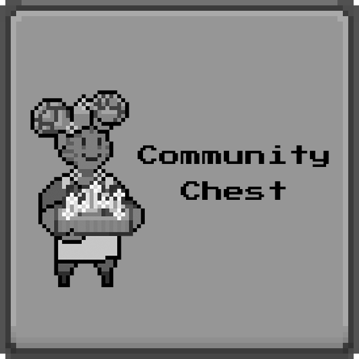

# Community Chest

## Overview

The Community Chest is an investment fund controlled exclusively by the Player 2 community. Players will be able to propose and vote on what the fund should be investing in.

## Constitution

1. DEO holders shall elect up to 10 Council Members who shall be responsible for controlling the Community Chest multi-signature wallet which contains the funds.
2. Each 10% of the circulating DEO may elect and maintain one Council Member in office.
3. For independence of operation and avoidance of possible conflicts, no paid staff of the Player 2 team shall be elected as a Council Member.
4. The Council shall select one member to act as Chairman of the Council.
5. The Chairman shall be the tiebreaker should the need arise.
6. While any holder may propose an investment, the council holds the power to approve or deny the proposals, regardless of the proposal vote outcome.
7. All investments shall be used for the growth of the Community Chest, and ideally include other benefits to the greater Player 2 community.
8. No single investment shall exceed 10% of the total Community Chest fund. This number shall be reduced to 5% once the fund exceeds US$1m in value.
9. The status of the fund shall be made transparent at all times. This can be done via monthly statements, a dashboard that tracks the investments in real-time, or other tools that may allow for transparent verification.
10. 95% of the profits shall be compounded back into the Community Chest.
11. 5% of the profits shall be paid to Player 2 as taxes.
12. In the event the Council wishes to dissolve the Community Chest fund, all assets are to be liquidated and deposited into the Player 2 Reserve, thereby benefitting the entire Player 2 community.

<figure><figcaption>
Player 2 Community Chest
</figcaption></figure>

