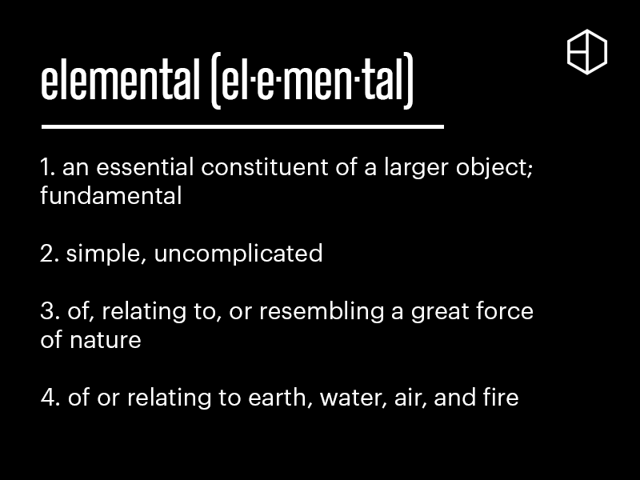

# Elemental

## Preface

#### Elemental = Fundamental

The word "elemental" refers to an essential constituent of a larger object. In other words, it refers to something fundamental.

Our crypto industry has become highly complex, and oftentimes in a bad way. Many projects lack clarity of purpose, and the vast majority obfuscate their economic design as they know it to be unsustainable. This has given rise to the culture of punting as opposed to value investing. The only important indicator is the intensity of hype. Flippers win, long term holders lose.

But this is destructive to an industry that wants to grow and incorporate the masses. Not everyone wants to gamble.

This is why we named our fund Elemental; we wanted to focus on the fundamentals. We wanted to focus on **what truly matters; yield**. To be specific: Sustainable, long-term yield.

#### Elemental = Simple

The word "elemental" also means simple and uncomplicated.

It is common for projects to display large gains, only for users to find out that there are fees and costs hidden between the layers. The net yield is usually not what is boldly advertised.

We think that is disingenuous, and it only harms the users.

At Elemental, our goal is to make investing simple for users. All they have to do is:

1\) Deposit

2\) Earn

And we will take care of the rest.&#x20;

And our promise is that **our displayed yield** will always be **the true yield** you receive.

There are no deposit or staking fees, no performance fees, no withdrawal fees. **There are no fees.**

**Elemental = Powerful**

Elemental also means power. It is used to describe great forces of nature.

While we are starting with humble beginnings, we believe our core design of "compounding" wields tremendous power. All our funds compound a portion of their gains. This means the longer they exist, the larger the yield they will be able to give.

Over time, this builds an increasingly wider economic moat.

#### Elemental = Balanced

Elemental can also relate to the four elements in nature: Earth, water, air, and fire. Together, these elements bring balance.

Likewise, we believe investing should be balanced. Our funds are named after the different elements and they inherently possess differing risks and opportunities.

We encourage users to take extra time to understand the nature of each fund and diversify your portfolio in accordance with your risk appetite.

Balance in all things.

<figure><figcaption>
Elemental Definition
</figcaption></figure>

