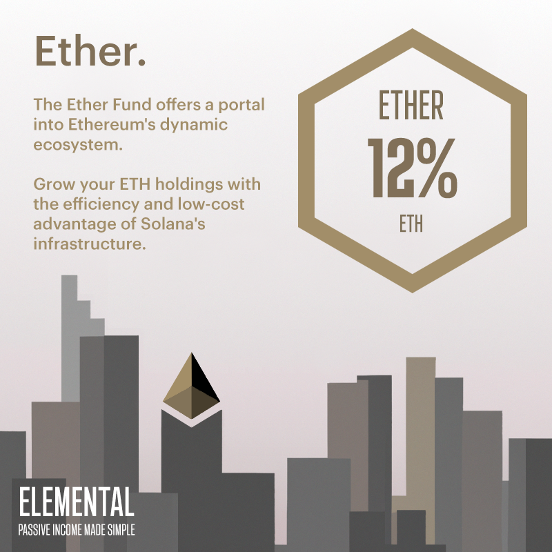

# Ether Fund

## Note: Ether has been officially sunset as of 06 Sep 2023

Due to limited yield opportunities on Solana, Elemental decided to sunset its Ether Fund. All deposits and associated yields were returned to its investors. While this decision was necessary for that point in time, Elemental remain open to reintroducing the Ether Fund should market dynamics shift favorably in the future.

## Ether Fund (12% APR)

The Ether Fund represents a transformative addition to Elemental's offerings, specifically designed for investors seeking exposure to the Ethereum ecosystem. Much like its namesake in chemistry, a volatile yet transparent liquid, the Ether Fund embodies the fluidity and transparency of Ethereum's DeFi landscape.

As with all of Elemental's funds, the Ether Fund is actively managed and operates entirely on-chain. The fund generates returns through strategic yield farming and arbitrage opportunities within Solana's DeFi sphere. Ether offers fixed true yields, providing an investment option that is both simple and transparent with no hidden fees or costs.

Much like the properties of ether in chemistry, the Ether Fund promises to provide investors with a clear and potent opportunity to grow their ETH holdings. However, like water, the value of returns in USD may ebb and flow with the market conditions, creating a dynamic investment that captures the essence of Ethereum's exciting space.

_Key Risk: Protocols getting exploited, key tokens depegging (>5%), Portal Bridge getting hacked_

## Artwork

<figure><figcaption>
Ether Fund Artwork
</figcaption></figure>

## Fund Characteristics

Fund Manager: P2 Moo ([https://twitter.com/player2moo](https://twitter.com/player2moo))

Element: Water

Base Token: Wrapped ETH (7vfCXTUXx5WJV5JADk17DUJ4ksgau7utNKj4b963voxs)

APR Type: Fixed

Compounds Gains: Yes

Capital Protected: Yes

Insurance Coverage: Partial

Access: Requires NFT

Minimum Deposit: 0.1 WETH

Maximum Deposit: 0.5 WETH per NFT

Withdrawal Period: Minimum 1 epoch and at the end of each epoch only. 1 epoch = 5 days.
