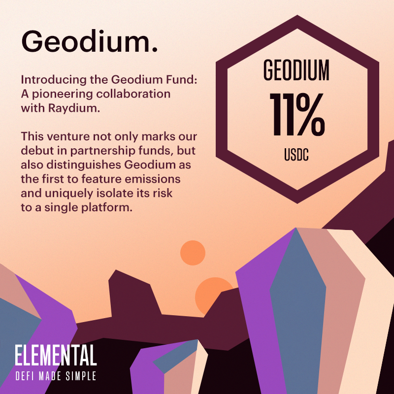

# Geodium Fund

## Geodium Fund (9% APR)

The Geodium Fund marks a significant milestone for us as it represents our first-ever partnership, joining forces with Raydium.

Dedicated to bolstering the liquidity of Raydium's USDC-USDT pool, the Geodium Fund meticulously narrows its exposure, limiting risk primarily to USDT and the USDC-USDT pool on Raydium. This strategic approach places the fund at the lowest end of the risk spectrum.

A distinctive feature of the fund is the support of RAY emissions, ensuring steady and competitive yields for our investors. Our commitment to maintaining these returns is unwavering, and we pride ourselves on that stability.

At Elemental, we believe in creating synergistic partnerships that benefit all parties involved, not just in the short term, but over an extended horizon. Our innovative Compound Fund grows every epoch and becomes permanent liquidity for Raydium, as long as the fund remains operational.

With the Geodium Fund, we offer an opportunity that stands out for its competitive yields, minimized risk, and the provision of ever-increasing liquidity to our partner, Raydium. It's a partnership model that encapsulates the very essence of a mutually beneficial alliance.

_Key Risk: USDT depegging, Raydium getting exploited._

## Artwork

<figure><figcaption>
Geodium Fund Artwork
</figcaption></figure>

## Fund Characteristics

Fund Manager: P2 Moo ([https://twitter.com/player2moo](https://twitter.com/player2moo))

Element: Earth

Base Token: USDC (EPjFWdd5AufqSSqeM2qN1xzybapC8G4wEGGkZwyTDt1v)

APR Type: Fixed

Compounds Gains: Yes

Capital Protected: Yes

Insurance Coverage: Partial

Access: Public

Minimum Deposit: 200 USDC

Maximum Individual Deposit: 100,000 USDC

Maximum Fund Capacity: 200,000 USDC

Withdrawal Period: Minimum 1 epoch and at the end of each epoch only. 1 epoch = 5 days.
