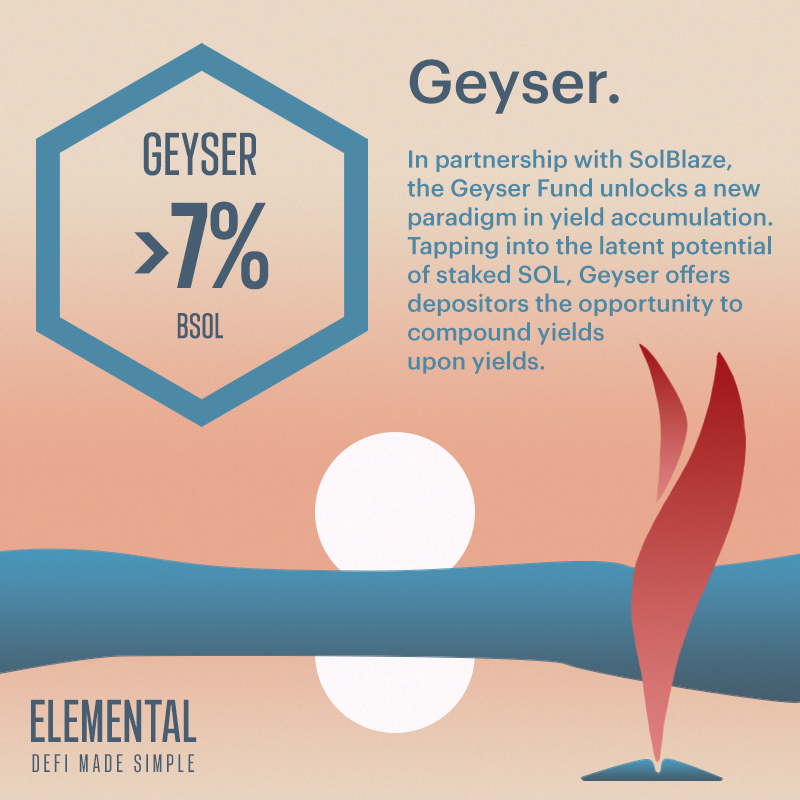

# Geyser Fund

## Geyser Fund (>7% APR)

The Geyser Fund, a result of our collaboration with SolBlaze, marks an advancement in Elemental's yield strategies. Central to this fund is the layering additional yields on bSOL. bSOL itself is a yield-bearing asset which inherently accumulates yields from Solana itself.

Moreover, the Geyser Fund introduces an exciting dimension by being the first Elemental fund to offer an additional token, BLZE, alongside its base yield. This inclusion makes the overall yield dynamic, elevating the fund's attractiveness and potential returns.

By integrating these elements, Geyser stands as a testament to Elemental's commitment to offering high-yield opportunities in the DeFi space, while keeping it simple for our depositors.

_Key Risk: Protocols getting exploited, liquid staking tokens depegging._

## Artwork

<figure><figcaption>
Geyser Fund Artwork
</figcaption></figure>

## Fund Characteristics

Fund Manager: P2 Moo ([https://twitter.com/player2moo](https://twitter.com/player2moo))

Element: Water

Base Token: bSOL (bSo13r4TkiE4KumL71LsHTPpL2euBYLFx6h9HP3piy1)

APR Type: Fixed

Compounds Gains: Yes

Capital Protected: Yes

Insurance Coverage: Partial

Access: Public

Minimum Deposit: 10 bSOL

Maximum Individual Deposit: 1,000 bSOL

Maximum Fund Capacity: 4,000 bSOL

Withdrawal Period: Minimum 1 epoch and at the end of each epoch only. 1 epoch = 5 days.

Special: Earn an additional 15 BLZE tokens per bSOL per epoch
