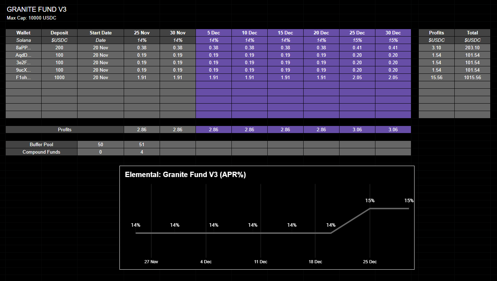

# Granite Fund V3

## Granite Fund (14% APR)

The Granite Fund produces fixed-yield in $USDC.

It invests in various opportunities across the Solana ecosystem, with the overall fund maintaining low-medium risk.

Granite is a ubiquitous stone found in bedrock, and this fund aims to be the bedrock of Elemental; strong and reliable.

_Key Risk: Stablecoins devaluing._

<figure><figcaption>
Grey = Confirmed | Purple = Example Data
</figcaption></figure>
