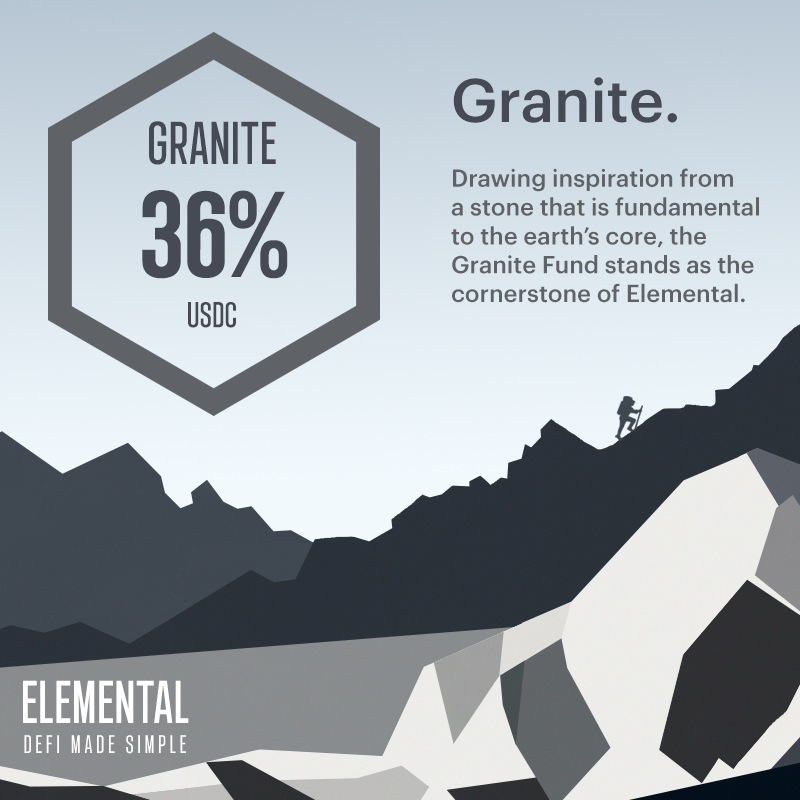

# Granite Fund

## Granite Fund (36% APR)

The Granite Fund is Elemental's flagship USDC fund, designed to offer the highest capital-protected, risk-adjusted returns for investors.

As an actively managed fund, Granite generates returns primarily through yield farming and arbitrage opportunities on Solana DeFi, operating 100% transparently on-chain. With fixed yields that represent true yields, Granite offers a simple and transparent investment option without any hidden fees or costs. The fund auto-compounds a portion of its gains, enabling it to grow its annual percentage rate (APR) over time. With a constant stream of income, Granite provides investors with the opportunity to earn passive income on their USDC holdings.

Drawing inspiration from a stone that is fundamental to the earth’s core, the Granite Fund stands as the cornerstone of Elemental.

_Key Risk: Various stablecoins depegging, oracle issues, protocols getting exploited._

## Artwork

<figure><figcaption>
Granite Fund Artwork
</figcaption></figure>

## Fund Characteristics

Fund Manager: P2 Moo ([https://twitter.com/player2moo](https://twitter.com/player2moo))

Element: Earth

Base Token: USDC (EPjFWdd5AufqSSqeM2qN1xzybapC8G4wEGGkZwyTDt1v)

APR Type: Fixed

Capital Protected: Yes

Insurance Coverage: Partial

Access: Requires NFT

Deposit: 1000 USDC per NFT

Maximum Fund Capacity: 30,000 USDC

Withdrawal Period: Minimum 1 epoch and at the end of each epoch only. 1 epoch = 5 days.
