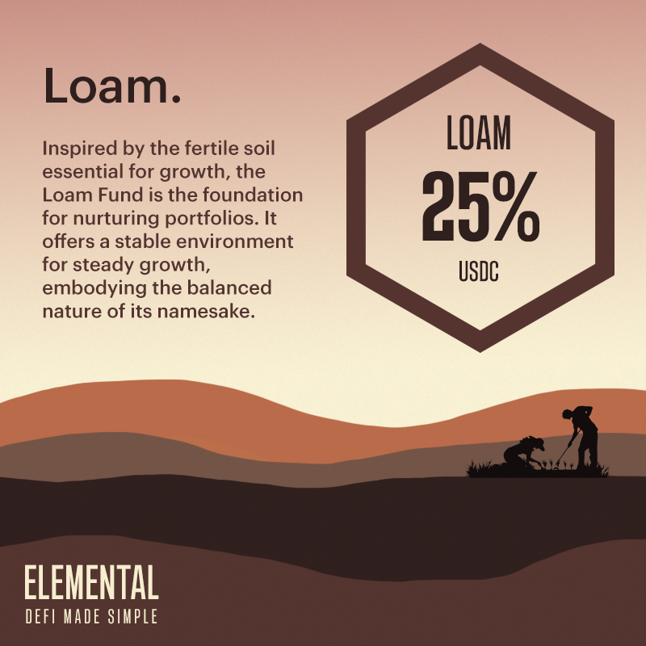

# Loam Fund

## Loam Fund (25% APR)

The Loam Fund provides capital protection, risk-adjusted returns, and accessibility to all.

Managed actively, Loam generates returns through yield farming and arbitrage opportunities on Solana DeFi, operating with full transparency on the blockchain. With fixed yields that represent true yields, Loam provides a simple and transparent investment option without hidden fees or costs.

The fund is named after a type of soil that is nutrient-rich and has the right texture to retain the perfect amount of water, making it ideal for gardening and agricultural purposes. Loam Fund is denominated in USDC, and we envision it as a stable foundation for growing your portfolio steadily.

_Key Risk: Various stablecoins depegging, oracle issues, protocols getting exploited._

## Artwork

<figure><figcaption>
Loam Fund Artwork
</figcaption></figure>

## Fund Characteristics

Fund Manager: P2 Moo ([https://twitter.com/player2moo](https://twitter.com/player2moo))

Element: Earth

Base Token: USDC (EPjFWdd5AufqSSqeM2qN1xzybapC8G4wEGGkZwyTDt1v)

APR Type: Fixed

Capital Protected: Yes

Insurance Coverage: Partial

Access: Public

Minimum Deposit: 1000 USDC

Maximum Individual Deposit: 50,000 USDC

Maximum Fund Capacity: 100,000 USDC

Withdrawal Period: Minimum 1 epoch and at the end of each epoch only. 1 epoch = 5 days.
