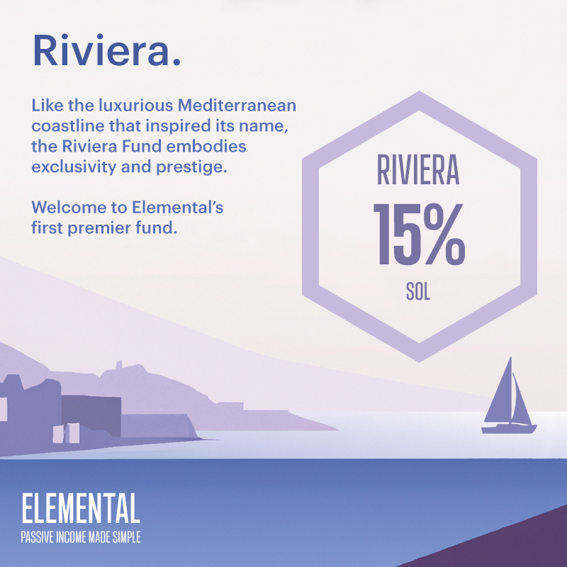

# Riviera Fund

## Riviera Fund (15% APR)

The Riviera Fund is a premier SOL fund tailored exclusively for high net worth individuals and projects seeking to invest their treasuries a simple but secure environment. The Riviera Fund delivers exceptional risk-adjusted returns, and personalized attention to its clientele.

As an actively managed fund, Riviera generates returns primarily through yield farming and arbitrage opportunities on Solana DeFi, operating with complete transparency on the blockchain. Fixed yields that represent true yields ensure that Riviera offers a simple and transparent investment option without hidden fees or costs.

Like the luxurious Mediterranean coastline that inspired its name, the Riviera Fund embodies exclusivity and prestige. As the tides of the Riviera coast rise and fall, the fund's yields will also fluctuate based on the availability of opportunities on Solana DeFi, but with a consistent focus on delivering unparalleled returns for its discerning clientele.

## Artwork

<figure><figcaption>
Riviera Fund Launch
</figcaption></figure>

## Fund Characteristics

Fund Manager: P2 Moo ([https://twitter.com/player2moo](https://twitter.com/player2moo))

Base Token: SOL

APR Type: Fixed

Compounds Gains: No

Capital Protected: Yes

Insurance Coverage: Partial

Access: Public

Minimum Deposit: 800 SOL

Maximum Deposit: 5,000 SOL

Withdrawal Period: Minimum 1 epoch and at the end of each epoch only. 1 epoch = 5 days.
