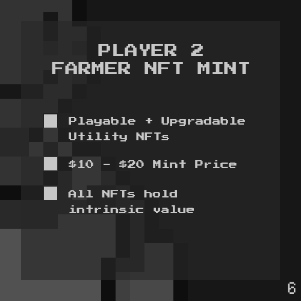

# Chapter 6

The most important question, finally!

We’re releasing the Genesis Series of our Farmer #NFTs. This will be the only series that will be minted in $USDC. Subsequent series will be using our $DEO currency.

They will be priced affordably (10-20 $USDC) for accessibility.

Our Genesis Farmers will...&#x20;

1\) Serve as your access pass to our game.

2\) Allow you to farm various tokens.

3\) Be composable: They can be upgraded, combined, and even battle in the future.

4\) Will have an intrinsic value - if the market price ever falls the mint value, Players may burn their NFTs to get money.

Looking for the art reveal? Look closely and you may find that it’s been right in front of you…
