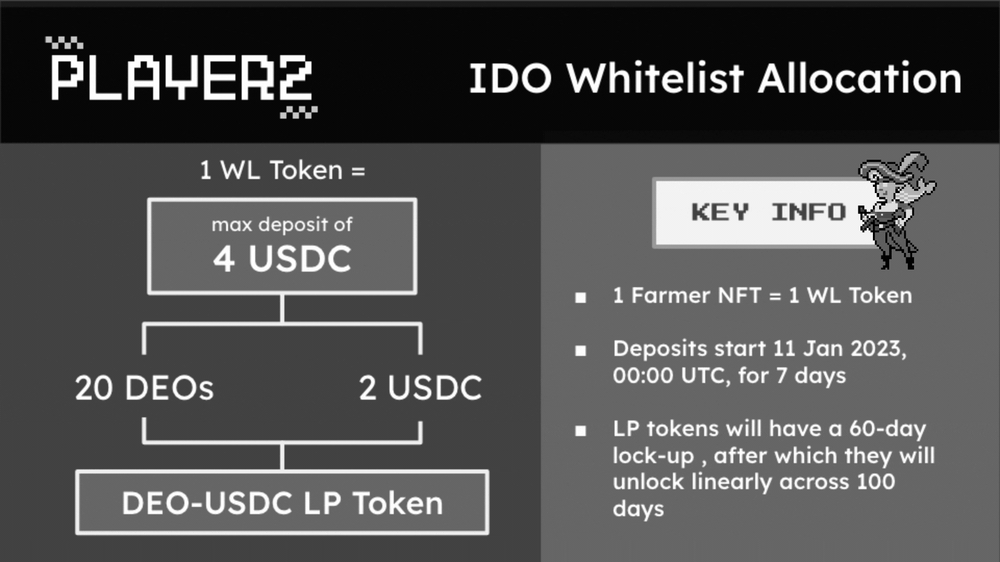

# IDO FAQ

**How much is the IDO allocation per NFT?**

Each NFT will grant you 1 WL token that allows a maximum deposit of 4 USDC. We will be taking a snapshot somewhere between 8-11 Jan, and will be airdropping the WL tokens thereafter. The more NFTs you hold, the more WL tokens you will receive.

**What will the deposits be used for?**

Half the deposit will be swapped into DEOs, while the other half will remain as USDC. We will combine them to form our genesis DEO-USDC liquidity pool (LP). Since your deposits will become LP tokens, they will start accruing yield immediately.

<figure><figcaption></figcaption></figure>

**This means the team receives nothing from the IDO?**

You are correct. All IDO funds go into the Reserve. This is by design, and this is why DEOs are so special.

**What is the IDO timeline?**

Deposits start at 12 Jan 2023, 00:00 UTC. We will keep the deposits open for 5 days and the DEO will officially start trading on 18 Jan 2023, 00:00 UTC.

**Is there a lockup period?**

Yes. Your DEO-USDC LP tokens will be locked up for a total of 60 days starting 18 Jan, following which they will be unlocked linearly across 100 days.

**What is the IDO price for the DEO?**

The IDO price will be 0.1 USDC

**Do I have to burn my Farmers for the WL token?**

No, absolutely not! You can hold on to your farmers. Our burn mechanism only comes into play when our game is live, where you can burn each NFT for 100 DEOs.

**What if I have Farmers on loan during the snapshot?**

Not to worry, you will still be allocated WL tokens for your loaned Farmers!

**Where can I make my deposits?**

We will be accepting deposits via [https://future-farms.player2.world](https://future-farms.player2.world). A new character will soon appear to receive your deposits!

**Is there any other way to participate in the IDO?**

We will be offering whitelist tokens to select projects whose communities align with our P2 values. However, owning farmers is the ONLY guaranteed way of participating; we will not dictate how other communities allocate their whitelist spots amongst their members.

**I have earned DEOs by participating in community events in 2022! When do I get my DEOs?**

All pre-earned DEOs will follow the same unlocking schedule as the LP tokens.

\
