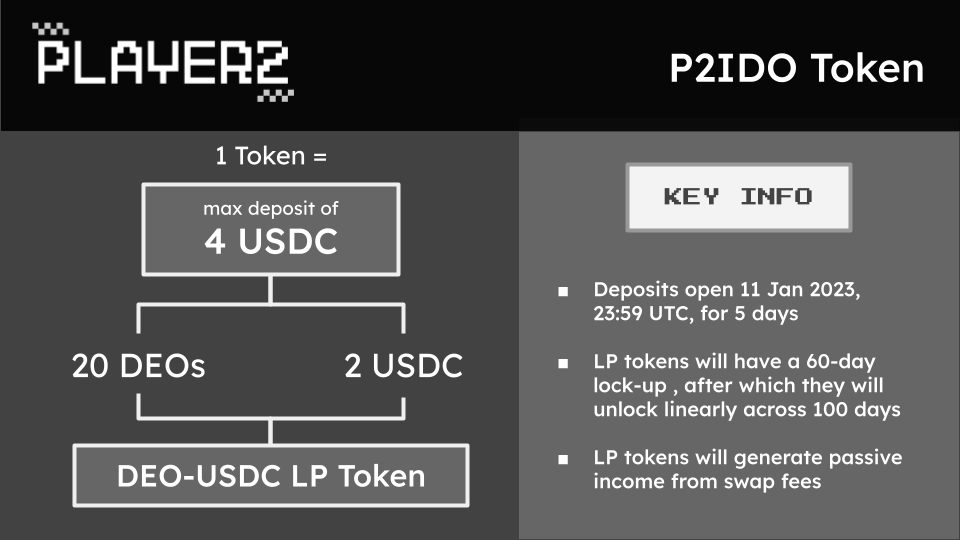
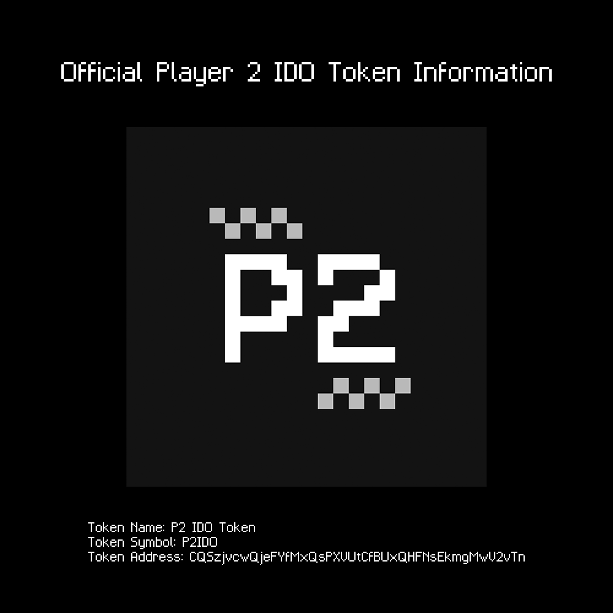

# IDO FAQ

**What is this P2IDO token?**

It allows you to deposit into our IDO fund.

**What will the deposits be used for?**

Half the deposit will be swapped into DEOs, while the other half will remain as USDC. We will combine them to form our genesis DEO-USDC liquidity pool (LP). Since your deposits will become LP tokens, they will start accruing yield immediately.

<figure><figcaption></figcaption></figure>

**This means the team receives nothing from the IDO?**

You are correct. All IDO funds go into the Reserve. This is by design, and this is why DEOs are so special.

**What is the IDO timeline?**

Deposits start at 11 Jan 2023, 23:59 UTC. We will keep the deposits open for 5 days and the DEO will officially start trading on 18 Jan 2023, 23:59 UTC.

**What is the P2IDO token address?**

CQSzjvcwQjeFYfMxQsPXVUtCfBUxQHFNsEkmgMwV2vTn

<figure><figcaption></figcaption></figure>

**Is there a lockup period?**

Yes. Your DEO-USDC LP tokens will be locked up for a total of 60 days starting 18 Jan, following which they will be unlocked linearly across 100 days.

**What is the IDO price for the DEO?**

The IDO price will be 0.1 USDC

**I have earned DEOs by participating in community events in 2022! When do I get my DEOs?**

All pre-earned DEOs will follow the same unlocking schedule as the LP tokens.

\
