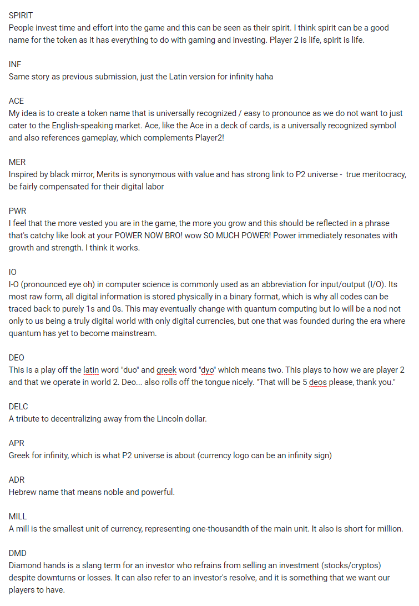

# The Birth of Deo

**A long time ago in a galaxy far, far away** our team at Player 2 embarked on a mission to find the perfect name for our perfect currency. Before Deo became the star of our ecosystem, it had to face a series of intense voting battles.

Feast your eyes on the image below, where you can see the fierce "finalists" who made it to the last round. It was a nail-biting contest, with the final votes cast on December 5th, 2021. As we all know, Deo ultimately claimed victory.

But have you ever wondered who the runners-up were in this thrilling race?

Diamond (DMD) dazzled its way into second place, while Power (PWR) surged into third, missing out on the runner-up spot by a mere single point. It's amusing to look back on these alternative possibilities now, but it also serves as a reminder of how delicate the democratic process can be. One single event or vote can have the potential to drastically change the course of history – for better or for worse.

Today, we take pride in Deo as a vital component within our Player 2 ecosystem. While our journey so far has been nothing short of remarkable, we are fully aware that there is still much work to be done.

As we navigate through the oscillating market conditions, our commitment to building and enhancing the Player 2 ecosystem remains steadfast. Together with our incredible community, we will continue to forge ahead. Game on!

<figure><figcaption></figcaption></figure>
