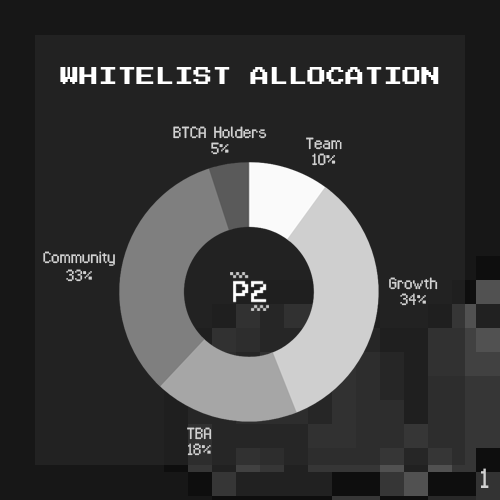

# Chapter 1

The #SolanaNFT space has seen tremendous growth in the past weeks, with many new wallets coming from the #Ethereum community.

Our crypto brethren have traveled far from their gaseous world, so the least we can do is to make them feel warm and fuzzy.

While team #Solana has delivered their promise of speed, our #NFT space is sadly still riddled with controversy.

\#Solana is filled with many helpful members - some aid with education @gaius1337, some make us laugh @icedknife, while others lift us up in times of uncertainty @powerofpixel.

Unfortunately there are those among us, who are less than savory.

Rugs, cash grabs, and toxicity - these are merely some of their expertise.

But these individuals are few, so the meta we can change as the majority.

In a bid to do our part, we have designed our allocation uniquely; A portion of our #whitelist goes to the special people in our community.

You may nominate yourself or others, but proof-of-work we must see.

One important point is the work must be done before today - we do this as we value honesty.

Keep an eye out for further details, but for now we’ll continue with follow, tag, like, and retweet, to market our project like most would normally.

P.S. if you are a project or DAO that would like to collaborate with us, ping us and we’ll be happy to talk about an opportunity.
