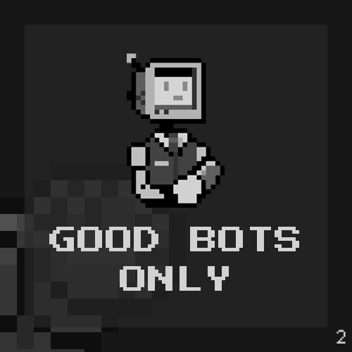

# Chapter 2

We love technology and we want to use it to build a kind and genuine community. However our #SolanaNFT space is riddled with those who use it negatively. To win the war, we must upkeep our values, but also understand the enemy’s modus operandi.

Here are common ways technology is used negatively and our solutions to them:&#x20;

#### Problem 1: Botting a mint

This not only causes congestion on the #solana network, but puts those without a bot at a serious disadvantage.&#x20;

Solution: Have a fully #whitelisted mint + everyone who is whitelisted will be guaranteed a mint. Who doesn’t like a stress free mint?

#### Problem 2: Gaming #whitelists on Twitter

Many are programmed to sniff out common launch terms and will automatically like, retweet, and tag 3 “friends”.&#x20;

Solution: We’ve added an extra but simple requirement for our responses such as an emoji for the first, or telling us why your friends are awesome for the second! We’ve also picked different tag numbers - anything but three. Here’s an example of bots clearly not understanding this.

#### Problem 3: Bots grinding on Discord

Tired of seeing GM, great projector, or copy pastas on the channels you are in? So are we.&#x20;

Solution: Our solution is our own bot. Using fire to fight fire! Our own AI (Sophie) can pick up on typical “spam language” and its variants. Sophie will also detect genuine conversations and recommend users for #whitelist consideration. No more grinding! No more spam!

We will give you more details about Sophie in Chapter 3.

Last but not least, bots are unfortunately still created by humans. To tackle the root of the problem, we’ll also need to discourage other negative human behavior.

Our project will ban anyone who:

* Uses bots or alt accounts (fair distribution please)
* Is caught selling their #whitelist (no shady markets)
* Displays toxicity (we value a kind and inclusive community)

Ultimately, all we want to know is whether you are a good human, and whether you are genuinely interested in finding out more about Player 2. If you can display that, you’re in! One of Player 2’s core tenets is crypto education and we believe a culture that fosters genuine conversations leads to collective learning.

See you on the other side, human 😉
