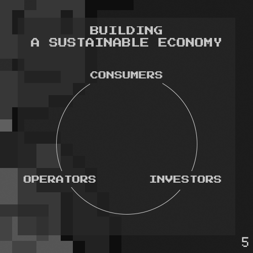

# Chapter 5

**99% of crypto projects do not have a sustainable economy.**

There exists three groups of people in a traditional company: Investors, operators, and consumers. Investors expect to grow their money, operators expect to get paid for their work, and consumers are happy to exchange their money for goods or services produced by the company.

Unfortunately, there are no consumers in the overwhelming majority of crypto projects. The bigger projects may boast plenty of users, but talk to them and you will realize most users expect to make a return on their money.

This leads us to the other problem: 99% of users think they are investors.

Most users are unknowing consumers. They think they are investors, but as a group they give up money to the true investors and operators. Those among them who make are simply winners in a negative sum game.

The hard truth is that most crypto users are gambling in one giant casino where the house always wins. Some are aware of this fact, but **most are not**.

Player 2 aims to solve this by bringing in real-world utility. We have a concept of Towns and Businesses. Business may be set up in the various Towns offering real services that Players can consume.

Do you know of a company that operates remotely? Well, that means they can set up their business in Player 2. They can service our people, and employ our people. We will help transition companies from #Web2 to #Web3.
