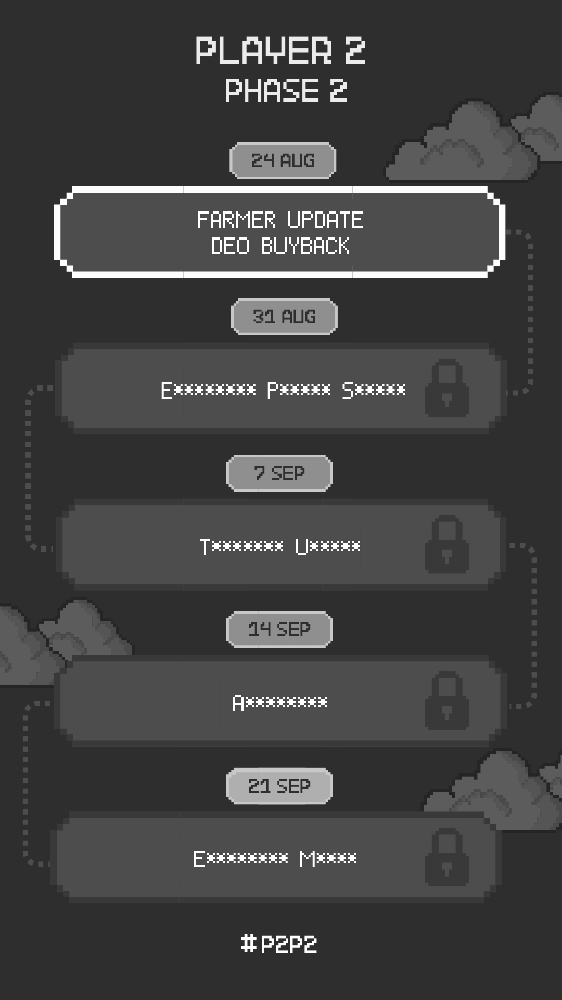

# 24 Aug 23

Greetings, Players!

After long hours in the trenches, we're super thrilled to finally bring forward the first of some **mega** updates!

**Update on Farmers NFTs:**&#x20;

* **Convert your Farmer NFTs:** You can finally burn and get back the full 100 DEO!
* **We're keeping things flexible:** Still fancy that liquidation-free loan? You can still take out that loan for 80 DEO.
* **Get ready for a transition:** The Farmer NFT reveal mechanism will be phased out at the end of September 2023.
* **Got an unrevealed Farmer?** No stress – you can still loan or burn post the sunset date.
* **Big win for Farmer NFT holders:** We're removing the 2-year expiration timer! Your farmers will retain their 100 DEO backing value for the foreseeable future.

**Update on DEO Buyback:**

* **Stats, stats, stats:** Our official emission and buyback metrics will soon be tracked and published, so you can stay up-to-date 24/7.
* **Burn:** With the conclusion of our vesting, all unclaimed DEO have been burnt.
* **Sustaining buybacks:** 5% of revenue generated at Elemental and Liquidation-free loans will be taxed. These taxes will power the DEO buyback and will be executed at random each month to prevent gamification.

**Teaser Alert!** The gears of Player 2 never stop churning. These updates mark just the start of our next big phase, or what we like to call, Player 2 Phase 2 (#P2P2). We’ve got major news incoming, including a brand-new world reveal.

And don't miss our advent calendar – a bit of fun and a hint of what's lurking in the shadows.

Can you piece the puzzle together? The first person to guess the right title of our upcoming 31 Aug announcement in our tweet below will win 100 DEO 

Stay alert, and game on! 

<figure><figcaption></figcaption></figure>

## FAQ

**Q: Will my unrevealed Farmer NFT become useless after September?**\
A: No. You'll still be able to take loans off them or burn them for 100 DEO.

**Q: How do I reveal my Farmer NFT?**\
A: Head over to [player2.world](https://player2.world), enter the game, and look for the "Reveal Farmers" button below.

.png>)

**Q: What were the Farmer NFT for besides their 100 DEO value?**\
A: They were originally planned for a game called "Future Farms". However, we believe that in order to survive the bear market, we need to focus on products that can give true value. As of date, those two are our [liquidation-free-loans.md](../businesses/liquidation-free-loans.md "mention") and [elemental](../businesses/elemental/ "mention"). They are both actively generating income for Player 2, and through the taxes they pay, will help with DEO buybacks. We will likely resume Future Farms development during the bull market.

**Q: How do I burn my Farmer NFT for 100 DEO?**\
A: Ping P2 Water on Discord in our Loans channel! It is a very similar process to how Players are currently getting their loans.
