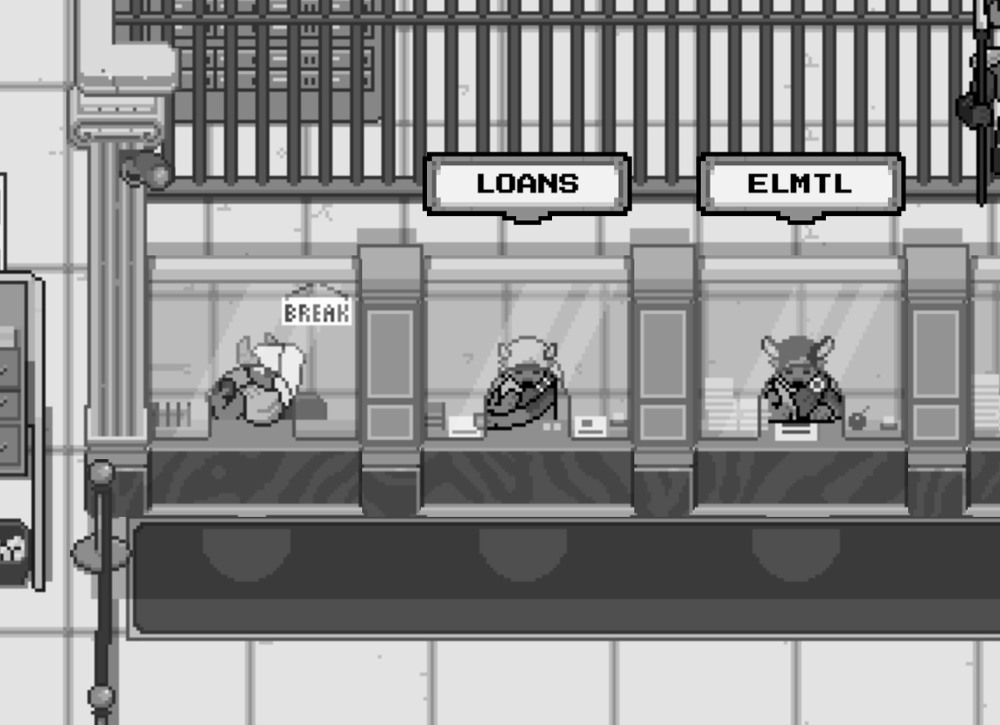

# tl;dr

## Player 2

Player 2 is a dynamic directory on Solana. We've transformed discoverability into an adventure, enabling users to learn about new projects in a gamified world.

## 1) A Directory for Solana

Player 2 serves as a one-stop directory for everything on Solana: from protocols and NFT projects to blogs and wikis.

## 2) **Making Discovery Fun**

Traditional directories can be mundane. In Player 2, businesses, referred to as [Businesses](../businesses/), come to life as Non-Player Characters (NPCs) in our gamified world. This offers users an engaging and immersive exploration experience.

<figure><figcaption></figcaption></figure>

## 3) $DEO: A Token with Intrinsic Value

The $DEO token is the beating heart of Player 2, and it's unlike any other token out there. What makes it unique is its intrinsic value (initially at $0.10 per $DEO) backed by a basket of assets. This intrinsic value not only ensures $DEO's resilience in fluctuating markets but also positions it as a token with a distinct risk-reward proposition.

## 4) $DEO Mechanics

We envision $DEO's value to appreciate over time, and for that, we've instituted the Twin Engines:

* **Treasury Growth:** A portion of Player 2's revenue feeds into expanding our Treasury, and the Treasury generates its own yields too. This continuous growth enhances the backing for each token.
* **Buyback Initiative:** Every business on Player 2 contributes a 5% tax. These funds are strategically used to repurchase $DEO and then added into liquidity pools. This increases buy pressure and creates deeper permanent $DEO liquidity, allowing for increasingly larger swaps with minimal slippage.

## We hang out on [Discord](https://discord.gg/player2)

Join us today and experience the benefits of a sustainable ecosystem built on the principles of integrity, innovation, and sound economics.
