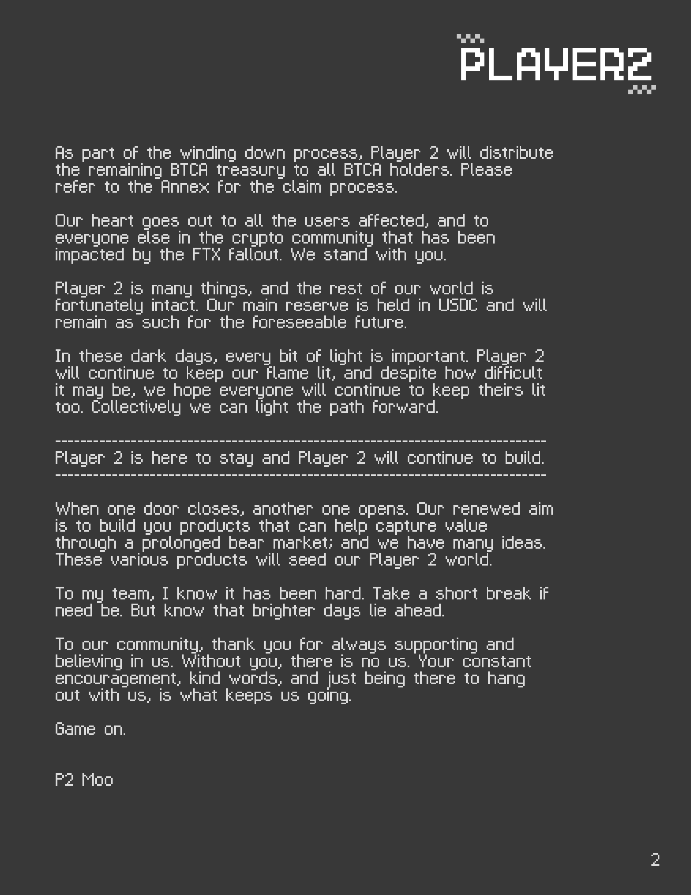
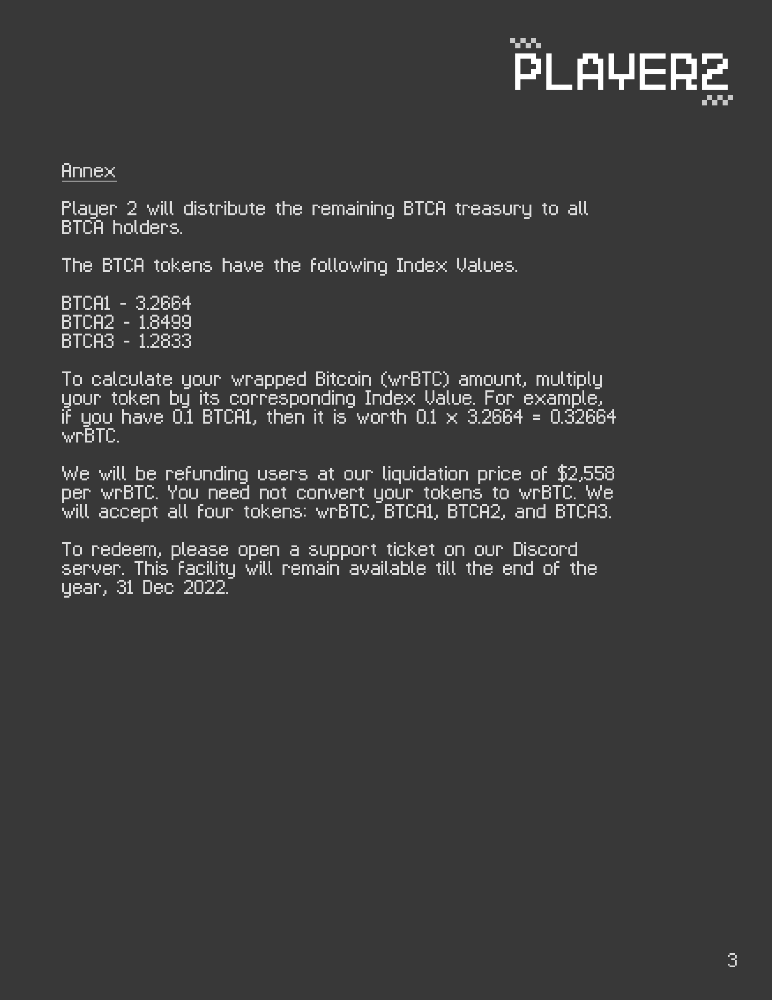

# The Bitcoin Accumulator

#### <mark style="color:red;">Please note that the Bitcoin Accumulator has been deprecated as of 15 November 2022 due to the collapse of Sollet BTC ($soBTC).</mark>&#x20;

<mark style="color:red;">$soBTC was the dominant Bitcoin token on Solana at that time, and the token was unfortunately the underlying asset of the Bitcoin Accumulator. $soBTC was minted by the Sollet bridge which was operated by FTX. The bridge ceased to function after FTX declared bankruptcy.</mark>

<mark style="color:red;">More details are in our official statement below.</mark>

<figure><figcaption></figcaption></figure>

 

<figure><figcaption></figcaption></figure>

 

<figure><figcaption></figcaption></figure>

####

####
