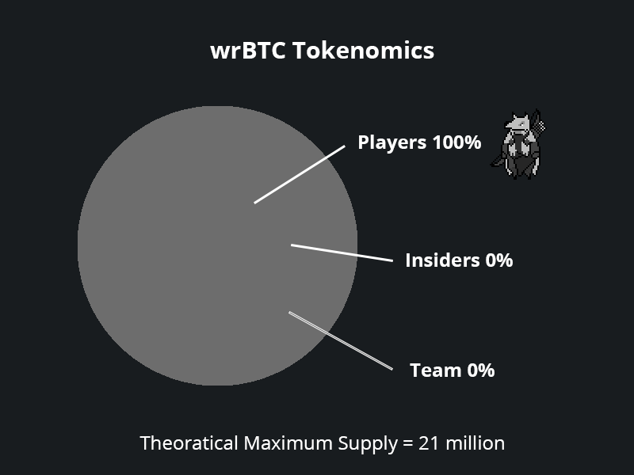

# Tokenomics

The Bitcoin Accumulator officially launched on March 5, 2022.&#x20;

Player 2's wrBTC token was fair launched with **no team allocation** and **no discounted presale.** Everyone had the opportunity to buy in at the exact same time.

The minting of wrBTC is controlled exclusively by the protocol. Since each wrBTC is intrinsically backed by one BTC, wrBTC cannot be minted without first depositing BTC. Thus, it is not possible to mint tokens for team allocation or for a discounted presale. wrBTC is a Solana native SPL token, which makes all its activities verifiable on-chain.

This means:

1\) wrBTC has a theoretical maximum supply of 21 million (if all BTC tokens get wrapped into wrBTC) and

2\) 100% of wrBTC tokens are held by Player 2's community of Players.

As for the three accumulator tokens BTCA1, BTCA2, and BTCA3, they can only be minted through the protocol using wrBTC and hence are derivatives of wrBTC. This means they hold the same underlying principals of wrBTC.
