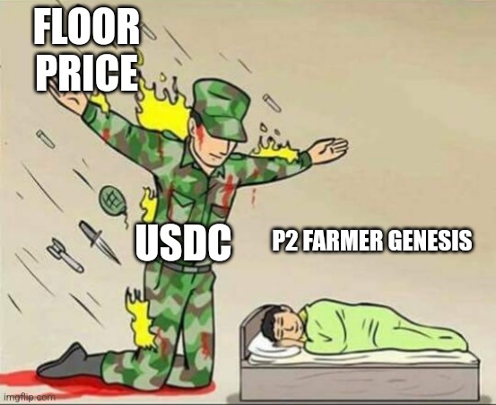

# Collateral

_What makes Player 2 different?_&#x20;

**Collateral.**&#x20;

[$DEO](https://twitter.com/search?q=%24DEO\&src=cashtag\_click) is our currency, and it will be collateralized.&#x20;

Many countries have a "currency reserve" which comprises of foreign currencies. This creates intrinsic value, and allows for a stable exchange rate.

Don't like speculative assets? Neither do we.&#x20;

This is why our [$DEO](https://twitter.com/search?q=%24DEO\&src=cashtag\_click) will be collateralized. If the price drops below the collateral, it becomes an arbitrage. This ensures that [$DEO](https://twitter.com/search?q=%24DEO\&src=cashtag\_click) will always have value and this is why our price chart will look VERY different from others.

**But there's more!**&#x20;

Our NFTs will also be exchangeable for [$DEO](https://twitter.com/search?q=%24DEO\&src=cashtag\_click). Don't like your NFT? Burn it. Get [$DEO](https://twitter.com/search?q=%24DEO\&src=cashtag\_click) back. This means our NFTs will ALSO have intrinsic value.

**But there's still more!**&#x20;

Our collateral is not static. It grows! As the our world expands, so will our collateral. This means we're not just bear market proof, we're going to grind higher regardless of the market conditions.&#x20;

Welcome to the [#valuemeta](https://twitter.com/hashtag/valuemeta?src=hashtag\_click).&#x20;

Bullish yet?

<figure><figcaption>
Floor Price Shield by <a href="https://twitter.com/Begallampung57">Begallampung57</a>
</figcaption></figure>

